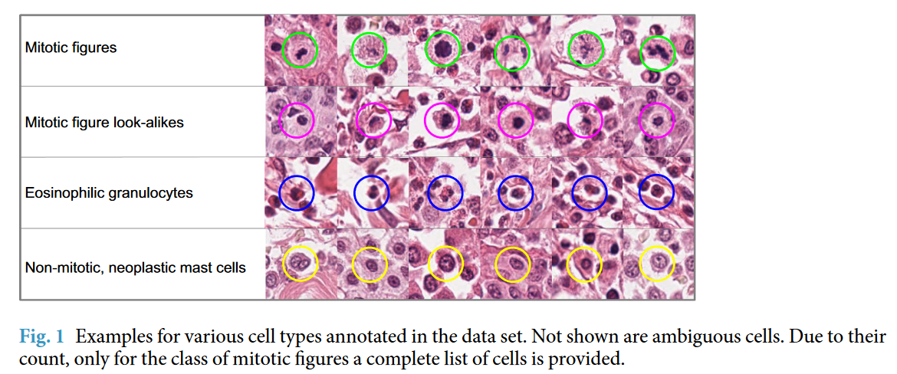

```yaml
Alumnos:
- Barrera Peña Víctor Miguel - 315346219
Materia: Procesamiento digital de imágenes
Clave: 1916
Título: Detector de cáncer animal
```


# Detector de cáncer animal

Proyecto final para la detección de cáncer para la procesamiento de imágenes digitales.

# Procedimiento realizado para detector

1. Buscar trabajos similares para tener datos y errores que ya han cometido, y de ser posible obtener modelos entrenados para hacer transferencia de conocimiento, ya que hay muy pocos datos para el entrenamiento. 

# Clasificación de mastocitos

En el contexto del cáncer de mastocitos en animales:

1. **Mitotic figures (Figuras mitóticas):** 
   Las figuras mitóticas son células que están en proceso de división celular (mitosis). En el contexto del cáncer de mastocitos, la presencia de numerosas figuras mitóticas puede ser un indicativo de un tumor de rápido crecimiento y potencialmente más agresivo.
2. **Mitotic figure look-alikes (Figuras similares a las mitóticas):** 
   Estas son estructuras o células que pueden parecerse a las figuras mitóticas pero que no son células realmente en división. Pueden incluir células apoptóticas (células en proceso de muerte programada) o artefactos en las preparaciones histológicas. Es importante diferenciarlas de las verdaderas figuras mitóticas para una evaluación precisa del tumor.
3. **Eosinophilic granulocytes (Granulocitos eosinofílicos):**
   Los granulocitos eosinofílicos son un tipo de glóbulo blanco que a menudo se encuentran en el tejido inflamado y en algunos tipos de tumores, incluidos los mastocitomas. Su presencia puede estar asociada con una respuesta inmune o inflamatoria en el tumor.
4. **Non-mitotic, neoplastic mast cells (Mastocitos neoplásicos no mitóticos):** 
   Estos son mastocitos cancerosos que no están en proceso de división celular. La identificación de estos mastocitos es crucial para el diagnóstico del tumor de mastocitos. La evaluación de la cantidad de estas células, junto con las figuras mitóticas, ayuda a determinar la agresividad del cáncer.

Es importante conocer como clasificar los mastocitos, primero se tiene que hacer un clasificador de mastocitos genera y a partir de ahí saber el estado de los mismos. Gracias al documento consultado se puede obtener una primera vista de las 4 clasificaciones que existen y de manera visual.




Se encuentra en la página  2 del documento.

# Referencias

- https://github.com/DeepMicroscopy/MITOS_WSI_CCMCT?tab=readme-ov-file#readme
- https://www.nature.com/articles/s41597-019-0290-4.pdf
