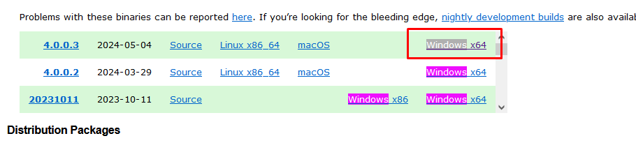
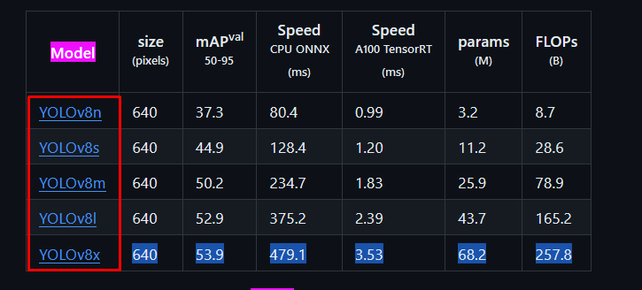
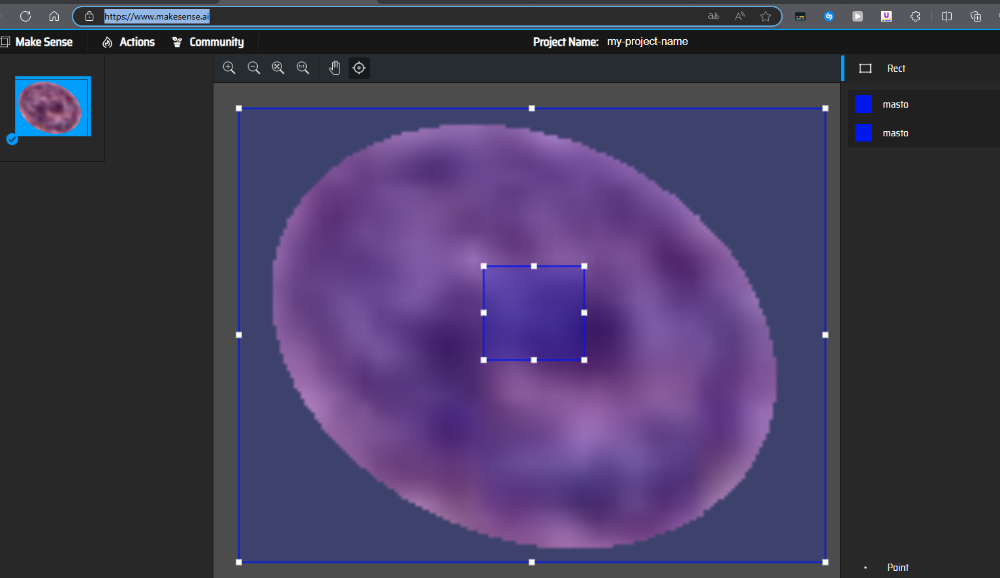

```yaml
Alumnos:
- Barrera Peña Víctor Miguel - 315346219
Materia: Procesamiento digital de imágenes
Clave: 1916
Título: Detector de cáncer animal
```


#  Configuraciones iniciales

## Configurar openSlide para windows con el siguiente código Abrir .svs

```python
# The path can also be read from a config file, etc.
OPENSLIDE_PATH = r'c:\path\to\openslide-win64\bin'

import os
if hasattr(os, 'add_dll_directory'):
    # Windows
    with os.add_dll_directory(OPENSLIDE_PATH):
        import openslide
else:
    import openslide
```

https://openslide.org/api/python/

## Desarcarg openSlide

https://openslide.org/download/#binaries



## Configurar  Yolov8

https://github.com/ultralytics/ultralytics?tab=readme-ov-file



Seleccionamos un modelo y lo colocamos dentro de la carpeta de código entre más abajo el modelo más potente y pesado es.

# Configurar Yolo v3 en gpu

https://www.youtube.com/watch?v=_FNfRtXEbr4

No me ha funcionado pero es el más cercano a funcionar con Darknet.

## Configurar Gpu con torch

https://www.youtube.com/watch?v=HQ7Ges1dhww&t=225s

# Herramienta para hacer etiquetado de imágenes online

[Make Sense](https://www.makesense.ai/)

Excelente herramienta para etiquetar las imágenes y funciona con el formato yolo.



# Detector de cáncer animal

Proyecto final para la detección de cáncer para la procesamiento de imágenes digitales.

# Procedimiento realizado para detector

1. Buscar trabajos similares para tener datos y errores que ya han cometido, y de ser posible obtener modelos entrenados para hacer transferencia de conocimiento, ya que hay muy pocos datos para el entrenamiento. 

# Procedimiento del tratamiento de imágenes

### Paso 1 Identificación de mastocitos

Primero, se identifican los mastocitos utilizando un algoritmo de detección en fotografías. Este algoritmo detecta los mastocitos y su ubicación en las imágenes.

### Segmentación de mastocitos

Una vez identificados los mastocitos, se procede a segmentarlos contorneándolos.

### Clasificación de mastocitos

A partir de la segmentación, se clasifica a los mastocitos en diferentes categorías: si están sanos, si están en una etapa donde pueden producir cáncer, o si están cercanos al desarrollo de cáncer.

### Análisis estadístico

Luego de la clasificación, se realiza un análisis estadístico para determinar el porcentaje de probabilidad de que el animal tenga cáncer.

### Preprocesamiento y entrenamiento

Para el preprocesamiento y entrenamiento de la red de detección de cáncer, antes de posicionar los mastocitos espacialmente en la imagen, se implementó un algoritmo que preprocesa las imágenes seleccionadas manualmente. Este algoritmo elimina los bordes de las imágenes para optimizar el entrenamiento de la red (automática).

# Clasificación de mastocitos

En el contexto del cáncer de mastocitos en animales:

1. **Mitotic figures (Figuras mitóticas):** 
   Las figuras mitóticas son células que están en proceso de división celular (mitosis). En el contexto del cáncer de mastocitos, la presencia de numerosas figuras mitóticas puede ser un indicativo de un tumor de rápido crecimiento y potencialmente más agresivo.
2. **Mitotic figure look-alikes (Figuras similares a las mitóticas):** 
   Estas son estructuras o células que pueden parecerse a las figuras mitóticas pero que no son células realmente en división. Pueden incluir células apoptóticas (células en proceso de muerte programada) o artefactos en las preparaciones histológicas. Es importante diferenciarlas de las verdaderas figuras mitóticas para una evaluación precisa del tumor.
3. **Eosinophilic granulocytes (Granulocitos eosinofílicos):**
   Los granulocitos eosinofílicos son un tipo de glóbulo blanco que a menudo se encuentran en el tejido inflamado y en algunos tipos de tumores, incluidos los mastocitomas. Su presencia puede estar asociada con una respuesta inmune o inflamatoria en el tumor.
4. **Non-mitotic, neoplastic mast cells (Mastocitos neoplásicos no mitóticos):** 
   Estos son mastocitos cancerosos que no están en proceso de división celular. La identificación de estos mastocitos es crucial para el diagnóstico del tumor de mastocitos. La evaluación de la cantidad de estas células, junto con las figuras mitóticas, ayuda a determinar la agresividad del cáncer.

Es importante conocer como clasificar los mastocitos, primero se tiene que hacer un clasificador de mastocitos genera y a partir de ahí saber el estado de los mismos. Gracias al documento consultado se puede obtener una primera vista de las 4 clasificaciones que existen y de manera visual.


Se encuentra en la página  2 del documento.

# Clasificación manual

Teniendo una imagen como entrada se tiene que hacer una clasificación manual de las células en la imagenes para poder realizar el detector.

# Aumento artificial del dataset 

Después de haber entrenado el modelo con +800 imágenes durante 10 épocas, no resulto que el modelo detectará alguna imagen fuera de las que tenía como entrenamiento, entonces se recurrió a investigar cuales eran las posibles causas determinando que tanto la falta de imágenes, el sobre ajuste y la falta de un dataset más grande es la causa más probable de este resultado.

Resultado de la investigación se llego a la tabla de configuración de Yolo v8 que es la siguiente:

| Argumento     | Tipo  | Predeterminado | Rango       | Descripción                                                  |
| ------------- | ----- | -------------- | ----------- | ------------------------------------------------------------ |
| hsv_h         | float | 0.015          | 0.0 - 1.0   | Ajusta el tono de la imagen por una fracción del círculo cromático, introduciendo variabilidad de color. Ayuda al modelo a generalizar en diferentes condiciones de iluminación. |
| hsv_s         | float | 0.7            | 0.0 - 1.0   | Altera la saturación de la imagen por una fracción, afectando la intensidad de los colores. Útil para simular diferentes condiciones ambientales. |
| hsv_v         | float | 0.4            | 0.0 - 1.0   | Modifica el valor (brillo) de la imagen por una fracción, ayudando al modelo a desempeñarse bien en diversas condiciones de iluminación. |
| degrees       | float | 0.0            | -180 - +180 | Rota la imagen aleatoriamente dentro del rango especificado de grados, mejorando la capacidad del modelo para reconocer objetos en varias orientaciones. |
| translate     | float | 0.1            | 0.0 - 1.0   | Traduce la imagen horizontal y verticalmente por una fracción del tamaño de la imagen, ayudando a aprender a detectar objetos parcialmente visibles. |
| scale         | float | 0.5            | >=0.0       | Escala la imagen por un factor de ganancia, simulando objetos a diferentes distancias de la cámara. |
| shear         | float | 0.0            | -180 - +180 | Cizalla la imagen por un grado especificado, imitando el efecto de objetos vistos desde diferentes ángulos. |
| perspective   | float | 0.0            | 0.0 - 0.001 | Aplica una transformación de perspectiva aleatoria a la imagen, mejorando la capacidad del modelo para entender objetos en el espacio 3D. |
| flipud        | float | 0.0            | 0.0 - 1.0   | Voltea la imagen de arriba abajo con la probabilidad especificada, aumentando la variabilidad de los datos sin afectar las características del objeto. |
| fliplr        | float | 0.5            | 0.0 - 1.0   | Voltea la imagen de izquierda a derecha con la probabilidad especificada, útil para aprender objetos simétricos y aumentar la diversidad del conjunto de datos. |
| bgr           | float | 0.0            | 0.0 - 1.0   | Invierte los canales de la imagen de RGB a BGR con la probabilidad especificada, útil para aumentar la robustez ante un orden incorrecto de los canales. |
| mosaic        | float | 1.0            | 0.0 - 1.0   | Combina cuatro imágenes de entrenamiento en una, simulando diferentes composiciones de escenas e interacciones de objetos. Altamente efectivo para la comprensión de escenas complejas. |
| mixup         | float | 0.0            | 0.0 - 1.0   | Mezcla dos imágenes y sus etiquetas, creando una imagen compuesta. Mejora la capacidad del modelo para generalizar al introducir ruido en las etiquetas y variabilidad visual. |
| copy_paste    | float | 0.0            | 0.0 - 1.0   | Copia objetos de una imagen y los pega en otra, útil para aumentar las instancias de objetos y aprender la oclusión de objetos. |
| auto_augment  | str   | randaugment    | -           | Aplica automáticamente una política de aumento predefinida (randaugment, autoaugment, augmix), optimizando para tareas de clasificación al diversificar las características visuales. |
| erasing       | float | 0.4            | 0.0 - 0.9   | Borra aleatoriamente una porción de la imagen durante el entrenamiento de clasificación, animando al modelo a centrarse en características menos obvias para el reconocimiento. |
| crop_fraction | float | 1.0            | 0.1 - 1.0   | Recorta la imagen de clasificación a una fracción de su tamaño para enfatizar las características centrales y adaptarse a las escalas de los objetos, reduciendo las distracciones del fondo. |

La información obtenida se encuentra en:

https://docs.ultralytics.com/usage/cfg/#augmentation-settings

Derivado de ello se busco configuraciones que tuvieran configuraciones que fuerán apropiadas y respaldas por la comunidad y en un foro de discusión de github del mismo respositorio encontré dicha configuración que tiene que ir en 

# Código

## Paso 2

Entrenar en Google Colab el modelo usando Yolo v8

[entrenador_cancer.ipynb - Colab (google.com)](https://colab.research.google.com/drive/1MCvBzCR3r0D9_yF-75LARjtZOA7AJR1p#scrollTo=TkIiTDsbtnuu)


# Referencias

- https://github.com/DeepMicroscopy/MITOS_WSI_CCMCT?tab=readme-ov-file#readme
- https://www.nature.com/articles/s41597-019-0290-4.pdf
- AMP Tech. (2021, 7 diciembre). *El mejor modelo de visión por computadora para tu proyecto* [Vídeo]. YouTube. Recuperado 31 de mayo de 2024, de https://www.youtube.com/watch?v=5MYpEtt0vsk
- Pantech Solutions. (2021, 5 enero). *Breast Cancer Detection using Yolo Algorithm* [Vídeo]. YouTube. Recuperado 31 de mayo de 2024, de https://www.youtube.com/watch?v=W7rvUqrqMWU
